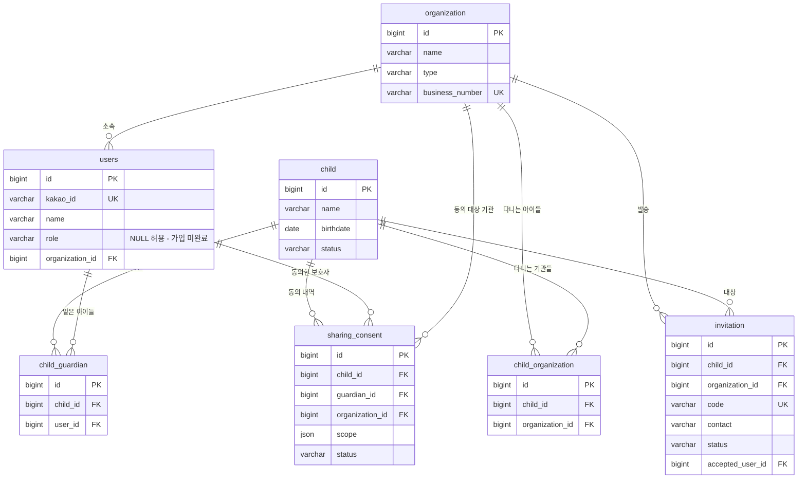
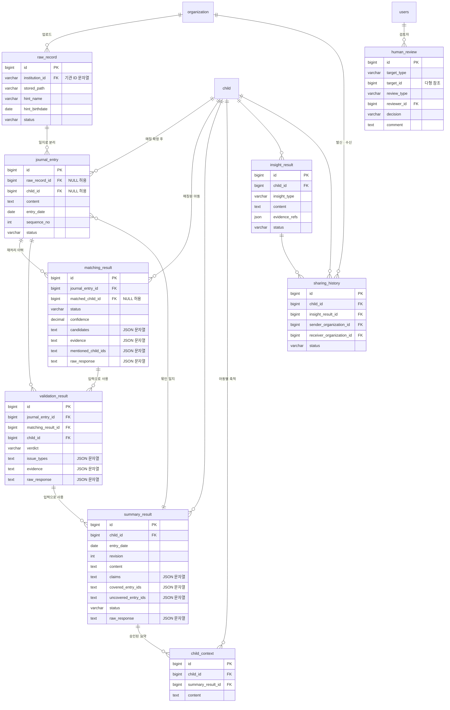

# 잇다 DB 스키마

> **이 문서가 DB 스키마의 원본이다.**
> 노션 「DB 수정본」은 이 문서를 주기적으로 옮겨 적은 **사본**이다. 노션을 먼저 고치지 않는다.
>
> **엔티티·테이블·컬럼·제약·enum 값을 바꾸는 PR은 이 문서를 같은 PR에서 고친다.** 예외 없음.
> 컬럼 하나 추가, NULL 허용 변경, enum 값 하나 추가도 해당한다.
> 코드와 이 문서가 다르면 **코드가 맞고 문서가 버그다.** 발견한 사람이 고친다.
>
> 고칠 때는 해당 절을 고치고, 맨 아래 **변경 이력**에 한 줄 남긴다.
> 설계와 다르게 구현했다면 §0.3 에도 적는다.

> **이 문서의 범위**
> 필수 테이블과 테이블 간 관계까지만 정한다. 세부 컬럼은 개발하면서 추가한다.
> 백엔드가 `ddl-auto: update`를 쓰기 때문에 **컬럼 추가는 자동 반영되지만, 관계 변경·컬럼 삭제·타입 변경은 자동 반영되지 않는다.**

---

## 0. 한눈에 보기

### 0.1 신뢰도 표시

| 표시 | 뜻 | 근거 |
| --- | --- | --- |
| ✅ **확정** | 바뀔 일 없음. 지금 구현해도 된다 | AI 코드에 박힌 계약 또는 기획 확정 사항 |
| 🟡 **초안** | 구조는 유지, **컬럼은 바뀔 수 있음** | 프론트 화면에서 역산. AI 계약이 아직 없음 |
| ⛔ **추정** | **근거 없음.** 예시일 뿐 | 누구도 확정한 적 없는 값 |

### 0.2 테이블 16개 현황

| # | 테이블 | 설계 | 구현 (엔티티) | 삭제 방식 |
| --- | --- | --- | --- | --- |
| 1 | `users` | ✅ 확정 | ✅ `User` | `deleted_at` |
| 2 | `organization` | ✅ 확정 | ✅ `Organization` | 삭제 없음 |
| 3 | `child` | ✅ 확정 | ✅ `Child` | `deleted_at` |
| 4 | `child_organization` | ✅ 확정 | ✅ `ChildOrganization` | `deleted_at` |
| 5 | `invitation` | ✅ 확정 | ⬜ 미구현 | `status` 로 대체 |
| 6 | `child_guardian` | ✅ 확정 | ⬜ 미구현 | `deleted_at` |
| 7 | `sharing_consent` | ✅ 확정 | ⬜ 미구현 | `status` 로 대체 |
| 8 | `raw_record` | ✅ 확정 | ⚠️ `RawRecord` — 일부 다름 | `deleted_at` |
| 9 | `journal_entry` | ✅ 확정 | ✅ `JournalEntry` | `deleted_at` |
| 10 | `matching_result` | ✅ 확정 | ⚠️ `MatchingResult` — 설계와 다름 | 삭제 없음 (이력) |
| 11 | `validation_result` | ✅ 확정 | ✅ `ValidationResult` | 삭제 없음 (이력) |
| 12 | `summary_result` | ✅ 확정 | ✅ `SummaryResult` | 삭제 없음 (이력) |
| 13 | `human_review` | 🟡 초안 | ✅ `Approval` | 삭제 없음 (이력) |
| 14 | `child_context` | ✅ 확정 | ✅ `ChildContext` | 삭제 없음 (이력) |
| 15 | `insight_result` | 🟡 초안 | ⬜ 미구현 | 삭제 없음 (이력) |
| 16 | `sharing_history` | 🟡 초안 | ⬜ 미구현 | 삭제 없음 (이력) |

**확정 11개는 AI 계약과 무관하거나 이미 확정된 것들이다.**
`validation_result` 와 `summary_result` 는 에이전트 계약이 나와서 확정으로 올렸다.
🟡 나머지 4개는 Insight 에이전트 계약과 공유 정책이 정해진 뒤에 만든다.

삭제 방식은 §3.2 에서 설명한다. **`deleted_at` 이 붙은 6개 테이블만 삭제 대상이고, 나머지는 애초에 지우지 않는다.**

### 0.3 설계와 현재 코드가 다른 곳 ⚠️

> 기준: `backend/src/main/java/com/itda/backend/domain` · 대조일 2026-09-29.
> 이 목록이 비면 설계와 코드가 일치하는 것이다. 코드를 설계에 맞추든, 설계를 코드에 맞추든 **맞춘 뒤 여기서 지운다.**
> 이름·타입만 다르던 것(`stored_path`, TEXT 로 저장한 JSON 등)은 설계를 코드에 맞춰 이미 정리했다.

| 테이블 | 설계 | 현재 코드 | 비고 |
| --- | --- | --- | --- |
| `raw_record` | `organization_id BIGINT` | `institution_id VARCHAR(255)` | 기관 ID 숫자를 문자열로 저장. 배포 DB 컬럼 타입을 `ddl-auto`가 못 바꿔서 유지 중 (§6.1) |
| `raw_record` | status 가 파이프라인 단계 (`UPLOADED` → `PARSED` → `PROCESSING` → `COMPLETED`) | status `PENDING` `REVIEW` `BLOCKED` `FAILED` 중 실제로는 `PENDING`(저장 성공)·`FAILED`(저장 실패)만 씀 | 파이프라인 단계는 API `O-21 stage`로 따로 내려준다 (§6.1) |
| `matching_result` | 이력이라 수정하지 않음. 재처리는 새 행 | 사람이 확인 큐에서 처리하면 **기존 행을 수정**한다 (`status → AUTO`, `matched_child_id` 덮어씀, `reviewer_id` 기록) | §7.1 |
| `matching_result` | 검토자는 `users.id` BIGINT (`human_review.reviewer_id`와 같게) | `reviewer_id VARCHAR(255)` 에 `users.id`를 문자열로 저장 | §7.1 |

---

## 1. ERD

> ERD 블록에는 핵심 컬럼만 적는다. `created_at` · `updated_at` · `deleted_at` 은 §3 공통 규칙을 따르므로 생략한다.

### 1.1 계정 · 아동 · 동의 ✅ 확정



### 1.2 파이프라인

`raw_record` · `journal_entry` · `matching_result` 까지가 ✅ 확정이고, 그 아래는 🟡 초안이다.



### 1.3 데이터 흐름

> 아래 온보딩 흐름은 **아동-보호자 연결** 관점이다. 그보다 먼저, 로그인한 사용자가
> 역할(기관/보호자)을 정하는 **회원가입**이 있다 — 이건 `invitation`과 무관하게
> `POST /api/v1/auth/signup`으로 처리된다 (§4.1 참고).

```
[온보딩]  ✅ 확정
Organization → Child 등록 → Invitation 발송
                              ↓
                   보호자 카카오 로그인 → ChildGuardian
                              ↓
                       SharingConsent 동의
                              ↓
                   child.status = ACTIVE  ← 여기서부터 파이프라인 가동

[파이프라인]
RawRecord          원본 파일 + 표지 힌트          ✅
      ↓ 1:N
JournalEntry       일지 한 건 — 처리 단위          ✅
      ↓
MatchingResult     어떤 아동의 기록인가?           ✅
      ↓            → journal_entry.child_id 확정
ValidationResult   사용 가능한 기록인가?           🟡
      ↓
SummaryResult      기록 요약                      🟡
      ↓
HumanReview GATE1  교사 승인                      🟡
      ↓
ChildContext       승인된 기록 축적                🟡
      ↓
InsightResult      변화 · 패턴 분석                🟡
      ↓
HumanReview GATE2  책임자 승인                    🟡
      ↓
SharingHistory     기관 간 공유                    🟡
```

---

## 2. 설계 원칙

### 2.1 관계 표현 — FK 제약을 걸지 않는다

- ERD의 관계선은 **논리적 관계**를 의미한다.
- 실제 DB에 `FOREIGN KEY CONSTRAINT`를 생성하지 않는다.
- 테이블에는 `raw_record_id`, `child_id` 같은 **ID 값만 저장**한다.
- JPA에서도 `@ManyToOne` / `@OneToMany`를 쓰지 않고 단순 `Long` 필드로 관리한다.
- 참조 대상의 존재 여부와 정합성은 **Service Layer에서 검증**한다.
- AI 각 단계의 결과를 별도 테이블로 분리해 단계 간 결합도를 낮춘다.

> **이 원칙의 대가 — 반드시 같이 읽을 것**
>
> FK 제약이 없으므로 **DB는 어떤 삭제도 막아주지 않고, 참조하는 행을 치워주지도 않는다.**
> `child` 한 행을 물리적으로 지우면 `journal_entry.child_id` · `matching_result.matched_child_id` ·
> `child_guardian` · `sharing_consent` 가 전부 존재하지 않는 ID를 가리킨 채 남는다.
> 에러도 나지 않고, 나중에 화면이 깨져서야 알게 되며, 복구할 방법이 없다.
>
> 그래서 §3.2 의 **삭제 금지(soft delete) 규칙은 선택이 아니라 이 원칙의 필수 짝이다.**

### 2.2 입력은 저장하지 않는다

`matching_input`, `validation_input` 같은 테이블은 만들지 않는다.
AI 입력은 기존 테이블에서 **그때그때 조립한다.**

```
MatchingInput
├── content          ← journal_entry.content
├── entry_date       ← journal_entry.entry_date
├── hint_name        ← raw_record.hint_name
├── hint_birthdate   ← raw_record.hint_birthdate
└── roster           ← child_organization + child
```

입력을 복사해두면 원본이 수정됐을 때 어긋난다.
대신 **어떤 입력을 썼는지는 결과 테이블의 ID 컬럼으로 기록한다** (`validation_result.matching_result_id`).

---

## 3. 공통 규칙 ✅ 확정

지금 정하지 않으면 나중에 바꿀 수 없는 항목이다.

| 항목 | 규칙 |
| --- | --- |
| PK | 전부 `BIGINT` auto increment. UUID를 쓰지 않는다 |
| 프론트 응답 | ID는 문자열로 직렬화해서 내려준다 (프론트 타입이 `string`) |
| AI 요청 | ID는 정수 그대로 보낸다 (AI 계약이 `int`) |
| 시각 컬럼 | `created_at`은 모든 테이블에. `updated_at`은 값이 바뀌는 테이블에만 |
| **삭제** | **어떤 행도 `DELETE` 하지 않는다.** `deleted_at`에 시각을 기록한다 (§3.2) |
| 열거형 | 문자열(`VARCHAR`)로 저장. DB `ENUM` 타입을 쓰지 않는다 |
| AI 응답 보관 | 결과 테이블은 `raw_response`에 응답 원본을 그대로 보관. 실제로 쓰는 값만 컬럼으로 승격 |
| JSON 컬럼 | 지금은 JSON 컨버터가 없어서 **`TEXT`에 JSON 문자열로 저장**한다 (`matching_result`). 아래 초안 테이블의 `JSON` 표기도 구현 시 같은 방식을 따른다 |

> **프론트 ID 직렬화는 아직 FE와 합의 전이다.** 프론트가 숫자로 바꾸겠다고 하면 이 규칙을 뒤집으면 된다. 백엔드는 어느 쪽이든 쉽다.

### 3.1 시각 컬럼

| 컬럼 | 타입 | NULL | 의미 |
| --- | --- | --- | --- |
| `created_at` | DATETIME | N | 생성 시각. 모든 테이블 |
| `updated_at` | DATETIME | N | 마지막 수정 시각. 값이 바뀌는 테이블만 |
| `deleted_at` | DATETIME | **Y** | **삭제 표시.** `NULL`이면 살아 있는 행 |

`deleted_at`을 찍을 때 `updated_at`도 같이 갱신된다(수정의 일종이다).

**예외 — `raw_record.updated_at`은 DB에서 NULL을 허용한다.** 배포 DB에 이미 행이 있어서
`ddl-auto: update`가 NOT NULL 컬럼을 추가하지 못하기 때문이다. 새 행과 수정되는 행은 코드가 항상 채운다.
나중에 추가하는 컬럼도 기존 행이 있는 테이블이면 같은 문제가 생긴다 (§11.4).

### 3.2 삭제 — Soft Delete ✅ 확정

**어떤 테이블도 `DELETE` 하지 않는다.** 삭제 요청은 `deleted_at`에 현재 시각을 기록하는 것으로 처리한다.
`deleted_at IS NULL`이면 살아 있는 행, 값이 있으면 삭제된 행이다.

#### 왜 이렇게 하나

§2.1 대로 FK 제약이 없어서 **DB가 아무것도 막아주지 않기 때문이다.** 세 가지 선택지 중 이것만 원하는 동작이 나온다.

| 방식 | 김하늘(`child.id = 5`)을 지우면 | 쓸 수 있나 |
| --- | --- | --- |
| FK + `CASCADE` | 일지·매칭결과·동의이력까지 전부 함께 삭제 | ❌ 기록과 동의 이력이 사라지면 안 된다 |
| FK + `RESTRICT` | 일지가 있으면 삭제 자체가 거부됨 | ❌ 화면의 삭제 기능이 동작하지 않는다 |
| FK 없이 물리 삭제 | 일지는 남고 `child_id = 5`가 존재하지 않는 행을 가리킴 | ❌ 누구의 기록인지 영영 알 수 없다 |
| **soft delete** | 아이 행도 일지도 그대로. "삭제됨" 표시만 붙는다 | ✅ |

부수적인 이유도 있다.

- 기관 담당자의 오삭제 복구 요청이 실제로 가장 흔한 운영 이슈다. `deleted_at = NULL`로 되돌리면 끝난다.
- 동의·공유 이력이 이 서비스의 핵심 기록인데, 아동 행이 사라지면 "누구 정보를 누구에게 줬는지"가 함께 사라진다.

#### `deleted_at`을 두는 테이블 (6개)

```
users
child
child_organization
child_guardian
raw_record
journal_entry
```

사용자가 화면에서 "삭제"·"연결 해제"·"탈퇴"를 할 수 있는 것들이다.

#### 두지 않는 테이블과 그 이유

| 테이블 | 이유 |
| --- | --- |
| `organization` | 회원가입 시 기관 담당자가 직접 생성하며(9.23 변경), 아직 삭제 기능이 없다. 나중에 필요해지면 같은 규칙으로 `deleted_at`을 추가한다 |
| `invitation` | `status = EXPIRED`가 이미 같은 일을 한다. 두 개를 같이 두면 "어느 쪽이 진짜인가"가 생긴다 |
| `sharing_consent` | `status = REVOKED`가 이미 같은 일을 한다. 위와 동일 |
| `matching_result` `validation_result` `summary_result` `human_review` `child_context` `insight_result` `sharing_history` | 실행·검토 이력이라 애초에 삭제 개념이 없다. 잘못된 결과는 지우는 게 아니라 다시 실행해서 새 행을 쌓는다 |

#### 조회 규칙 — 이게 핵심이다

**`deleted_at`을 두는 6개 테이블을 조회할 때는 반드시 `deleted_at IS NULL`을 붙인다.**

빠뜨리면 조용히 틀린다. 특히 위험한 곳:

- **매칭 명부(roster)** — `child_organization` + `child`에서 만든다. 조건을 빠뜨리면 **삭제한 아이가 명부에 다시 나타나 AI 매칭 대상이 된다.**
- **보호자 권한 확인** — `child_guardian`. 연결을 끊은 보호자가 계속 아이 기록을 볼 수 있게 된다.
- **기관 아동 목록·일지 목록** — 삭제한 항목이 화면에 그대로 뜬다.

#### 삭제된 대상을 가리키는 행의 처리

`journal_entry.child_id`나 `matching_result.matched_child_id`가 **삭제 표시된 `child`를 가리키는 상태는 정상이다.**
행이 남아 있으므로 이름은 계속 읽을 수 있다. 화면에서는 "삭제된 아동"으로 표시한다.

삭제된 아동의 일지는 새로 파이프라인을 태우지 않는다. 워커가 `child.deleted_at IS NULL`을 확인한다.

#### 개인정보 파기 요구는 별개다

soft delete는 **오삭제 복구와 이력 보존**을 위한 것이지, 영구 보관 수단이 아니다.
정보주체가 파기를 요구하면 그때는 실제로 데이터를 지우거나 익명화해야 한다.
그 절차는 이 문서의 범위 밖이며, 필요해지는 시점에 따로 정한다.

### 3.3 유니크 제약 — 나중에 붙일 수 없으므로 지금 건다

```
users.kakao_id                                UNIQUE
organization.business_number                  UNIQUE
invitation.code                               UNIQUE
child_organization(child_id, organization_id) UNIQUE
child_guardian(child_id, user_id)             UNIQUE
summary_result(child_id, entry_date, institution_id, revision) UNIQUE
```

#### soft delete와 유니크 제약의 충돌 — 반드시 읽을 것

삭제 표시된 행도 테이블에 그대로 남아 있으므로 **유니크 제약을 계속 차지한다.**
그래서 그냥 두면 이런 일이 생긴다.

```
기관에서 김하늘을 뺌        → child_organization 행에 deleted_at 기록
같은 아이를 다시 등록하려 함 → INSERT 시 UNIQUE 위반으로 실패
```

**해결: 다시 연결할 때 새 행을 만들지 않고, 기존 행을 되살린다.**

```
연결 요청 → (child_id, organization_id) 행이 있나?
             있고 deleted_at != NULL  → deleted_at = NULL 로 복구
             있고 deleted_at == NULL  → 이미 연결됨. 아무것도 하지 않는다
             없음                     → 새로 INSERT
```

같은 규칙이 적용되는 곳:

| 대상 | 상황 |
| --- | --- |
| `child_organization(child_id, organization_id)` | 기관에서 뺐다가 다시 등록 |
| `child_guardian(child_id, user_id)` | 보호자 연결을 끊었다가 다시 연결 |
| `users.kakao_id` | 탈퇴한 사람이 같은 카카오 계정으로 재가입 |

`deleted_at IS NULL`인 행만 유니크로 보는 부분 인덱스(partial unique index)가 정석이지만,
`ddl-auto: update`가 만들어주지 못하므로 쓰지 않는다.

---

# ✅ 확정 테이블

> 아래 10개는 **AI 코드에 박힌 계약** 또는 **기획 확정 사항**에서 나왔다.
> AI 에이전트가 앞으로 뭘 만들든 바뀌지 않는다. 지금 구현해도 된다.

---

## 4. 계정 · 조직

> **(9.25) 배포 주의 — 이전 스키마 테이블 정리**
> 배포 DB(PostgreSQL)에 이전 설계로 만들어진 `users`·`organization` 테이블이 이미 있다면 두 테이블을 지우고 배포한다.
> `ddl-auto: update`는 `users.role`의 NOT NULL 해제와 `organization.name`의 UNIQUE 제거를 해주지 않고,
> 기존 행이 있으면 NOT NULL인 `organization.business_number` 컬럼 추가도 실패한다.
> 로컬은 H2 인메모리(`create-drop`)라 재기동하면 초기화되므로 해당하지 않는다.

### 4.1 `users` ✅

> **근거** — 기획: 기관·부모 인증을 카카오로 통일 · 회원가입 설계(9.23) — 역할 결정 방식 변경

카카오 로그인 주체. 기관 담당자와 보호자 모두 이 테이블을 쓴다.

> **테이블명이 `user`가 아니라 `users`인 이유.** `USER`는 PostgreSQL 예약어라
> `@Table(name = "user")`로 두면 테이블 생성 자체가 실패한다.

| Column | Type | NULL | 설명 |
| --- | --- | --- | --- |
| `id` | BIGINT | N | PK |
| `kakao_id` | VARCHAR(50) | N | 카카오 회원번호. UNIQUE |
| `name` | VARCHAR(100) | Y | 카카오 닉네임. 사용자가 동의를 거부할 수 있어 NULL 허용 |
| `role` | VARCHAR(20) | **Y** | 역할. **NULL이면 "가입 미완료" 상태** (9.23 변경 — 이전엔 NOT NULL) |
| `organization_id` | BIGINT | Y | 소속 기관. `role = ORGANIZATION`일 때만 |
| `created_at` | DATETIME | N |  |
| `updated_at` | DATETIME | N |  |
| `deleted_at` | DATETIME | Y | **탈퇴 표시.** NULL이면 활성 계정 |

**`role`**

```
ORGANIZATION
PARENT
```

**(9.23 변경) 역할은 더 이상 로그인 진입 경로로 결정하지 않는다.** 카카오 로그인은 신원
확인만 하고, `role`은 `NULL`인 채로 계정이 생성된다. 사용자가 로그인 후 화면에서 역할을
직접 선택해 `POST /api/v1/auth/signup`을 호출해야 확정된다.

```
카카오 로그인 성공 → users row 생성, role = NULL (가입 미완료)
                              ↓
              GET /api/v1/auth/me → signupCompleted: false
                              ↓
              POST /api/v1/auth/signup { role: "org" | "parent", ... }
                              ↓
                    role 확정 (이후 변경 불가)
```

이전 설계(로그인 URL의 `?invite=` 파라미터로 역할을 정하던 방식, `LoginRoleHintFilter`)는
폐기했다. **초대 코드로 로그인에 들어왔는지는 더 이상 역할 결정에 쓰지 않는다** —
`invitation`(§5.3)은 아동-보호자 연결 전용이고, 회원가입 자체와는 무관하다.

`role`이 `NULL`인 사용자가 `/auth/me`, `/auth/signup`, `/auth/logout` 외의 보호 API를 호출하면
`403 SIGNUP_NOT_COMPLETED`로 막는다.

한 사람은 한 기관에만 속한다. 그래서 중간 테이블 없이 `organization_id` 컬럼 하나로 둔다.

**`deleted_at`** — 탈퇴한 보호자가 남긴 `child_guardian` · `sharing_consent` · `human_review.reviewer_id`가
존재하지 않는 `users` 행을 가리키지 않도록 행을 남긴다. 재가입은 §3.3 의 복구 규칙을 따른다.
로그인·세션 조회(`/api/v1/auth/me`)는 `deleted_at IS NULL`인 사용자만 인정한다.

### 4.2 `organization` ✅

> **근거** — 프론트 `InstitutionType` · 회원가입 설계(9.23) — 사업자등록번호로 1기관 1계정 구분

| Column | Type | NULL | 설명 |
| --- | --- | --- | --- |
| `id` | BIGINT | N | PK |
| `name` | VARCHAR(100) | N | 기관명 |
| `type` | VARCHAR(30) | N | 기관 유형 |
| `business_number` | VARCHAR(10) | N | 사업자등록번호. UNIQUE (9.23 추가) |
| `created_at` | DATETIME | N |  |
| `updated_at` | DATETIME | N |  |

**`type`**

```
SCHOOL
CENTER
ACTIVITY_SUPPORT
```

**`business_number`**

`^\d{10}$` 형식만 검사하고 무조건 통과시킨다. **실제로 존재하는 사업자번호인지, 이 기관이
장애아동 기관이 맞는지는 검증하지 않는다** (MVP 의도적 선택 — 자세한 이유와 향후 검증
방향은 [회원가입 설계] 문서 §6 참고). 체크섬 검증도 하지 않는다 — 테스트 데이터를 쉽게
넣기 위해서다. 하이픈 없이 저장한다.

**`name`에는 UNIQUE를 걸지 않는다 (9.23 변경).** 같은 이름의 센터가 실제로 여러 곳 있을 수
있다. 기관을 유일하게 구분하는 키는 `business_number`다.

**(9.23 변경) 기관 행은 더 이상 미리 시드하지 않는다.** 이전에는 시연용 기관을 시더가 DB에
미리 넣고, 로그인한 기관 담당자를 첫 번째 기관에 자동 배정했다. 이 방식(`OrganizationSeedService`,
자동 배정 로직)은 폐기했다. 지금은 기관 담당자가 `POST /api/v1/auth/signup`으로
기관명·기관유형·사업자등록번호를 직접 입력하면 그 시점에 `organization` 행이 새로 생성된다.

삭제 기능은 아직 없다. `deleted_at`을 두지 않는다.

---

## 5. 아동 · 연결 · 동의

### 5.1 `child` ✅

> **근거** — AI `RosterEntry(child_id, name, birthdate)` · 프론트 `ChildStatus`

| Column | Type | NULL | 설명 |
| --- | --- | --- | --- |
| `id` | BIGINT | N | PK |
| `name` | VARCHAR(100) | N | 아동 이름 |
| `birthdate` | DATE | **N** | 생년월일 |
| `status` | VARCHAR(30) | N | 등록 상태 |
| `created_at` | DATETIME | N |  |
| `updated_at` | DATETIME | N |  |
| `deleted_at` | DATETIME | Y | **삭제 표시.** NULL이면 살아 있는 아동 |

**`birthdate`가 NOT NULL인 이유**

AI 계약에서 필수값이다.

```python
class RosterEntry(BaseModel):
    child_id: int
    name: str
    birthdate: str    # 필수. None 허용 아님
```

비어 있으면 **그 아이는 매칭 명부(roster)에 넣을 수 없어 매칭 대상에서 빠진다.**
동명이인 구분에도 쓰이는 값이라 기관이 아동 등록 시 필수로 입력받는다.

**`status`**

```
PENDING_CONSENT   보호자 동의 대기 — 파이프라인이 돌지 않는다 (생성 시 기본값)
ACTIVE            동의 완료 — 파이프라인 가동
SUSPENDED         동의 철회 — 파이프라인 정지
```

기획의 **Consent First**가 이 컬럼으로 구현된다. 워커가 일지를 처리하기 전에 이 값을 본다.

**`status`와 `deleted_at`은 다른 것이다**

```
status = SUSPENDED   동의가 없어서 처리를 멈춘 상태. 아이는 기관에 그대로 있다
deleted_at != NULL   기관이 아이를 목록에서 뺀 상태. 조회 대상에서 빠진다
```

워커는 두 가지를 모두 본다 — `deleted_at IS NULL AND status = 'ACTIVE'` 일 때만 처리한다.

### 5.2 `child_organization` ✅

> **근거** — 프론트 `Child.institutions[]` (배열) · AI roster 구성

아동과 기관의 연결. **매칭 입력인 기관별 아동 명부(roster)가 이 테이블에서 나온다.**

| Column | Type | NULL | 설명 |
| --- | --- | --- | --- |
| `id` | BIGINT | N | PK |
| `child_id` | BIGINT | N |  |
| `organization_id` | BIGINT | N |  |
| `created_at` | DATETIME | N |  |
| `updated_at` | DATETIME | N |  |
| `deleted_at` | DATETIME | Y | **연결 해제 표시** |

`(child_id, organization_id)` UNIQUE. 재연결은 §3.3 의 복구 규칙을 따른다.

**왜 FK 컬럼 하나가 아니라 별도 테이블인가**

한 아이가 여러 기관에 다닌다. 기관마다 흩어진 기록을 연결하는 것이 서비스의 목적이다.

```
임유진 ─┬─ 특수학교
        ├─ 발달센터
        └─ 활동지원사
```

한 아이가 여러 기관, 한 기관에 여러 아이 → N:M이라 중간 테이블이 필요하다.

**roster를 만들 때 가장 흔한 실수**

```sql
-- 틀림: 기관에서 뺀 아이가 매칭 대상에 다시 들어온다
SELECT c.* FROM child c
  JOIN child_organization co ON co.child_id = c.id
 WHERE co.organization_id = ?

-- 맞음
SELECT c.* FROM child c
  JOIN child_organization co ON co.child_id = c.id
 WHERE co.organization_id = ?
   AND co.deleted_at IS NULL
   AND c.deleted_at IS NULL
```

### 5.3 `invitation` ✅ — ⬜ 미구현

> **근거** — 기획 변경: 부모 주도 → 기관 초대 방식

기관이 보호자에게 발송하는 초대. **보호자 계정이 아직 없는 상태에서 만들어진다.**

> **회원가입과는 다른 개념이다 (9.23 명확화).** 이 초대는 "이 아이의 보호자 연결"을 위한
> 것이지, 로그인 시 역할(기관/보호자)을 정하던 예전의 `?invite=` 방식과 무관하다. 보호자는
> 먼저 `POST /api/v1/auth/signup`으로 PARENT 가입을 끝낸 뒤, 이 `invitation`으로 특정
> 아동과 연결된다 (§4.1 참고).

| Column | Type | NULL | 설명 |
| --- | --- | --- | --- |
| `id` | BIGINT | N | PK |
| `child_id` | BIGINT | N | 대상 아동 |
| `organization_id` | BIGINT | N | 발송 기관 |
| `code` | VARCHAR(50) | N | 초대 코드. UNIQUE |
| `contact` | VARCHAR(100) | Y | 기관이 입력한 보호자 연락처 |
| `status` | VARCHAR(20) | N | 초대 상태 |
| `accepted_user_id` | BIGINT | Y | 수락한 보호자 user ID |
| `created_at` | DATETIME | N |  |
| `updated_at` | DATETIME | N |  |

**`status`**

```
PENDING
ACCEPTED
EXPIRED
```

**수락해도, 취소해도 행은 삭제하지 않는다.** `status`만 바뀐다. 같은 코드의 재사용을 막고,
누가 언제 초대했고 누가 수락했는지 이력이 남아야 하기 때문이다.
이미 `status`가 삭제 역할을 하므로 `deleted_at`은 두지 않는다 — 초대 취소는 `EXPIRED`다.

### 5.4 `child_guardian` ✅ — ⬜ 미구현

> **근거** — 기획: 보호자 2명 동의 기준 (미정 사항에 명시된 것 자체가 복수 보호자를 전제)

아동과 보호자의 연결. 보호자가 초대를 수락한 시점에 생성된다.

| Column | Type | NULL | 설명 |
| --- | --- | --- | --- |
| `id` | BIGINT | N | PK |
| `child_id` | BIGINT | N |  |
| `user_id` | BIGINT | N | 보호자 user ID |
| `created_at` | DATETIME | N |  |
| `updated_at` | DATETIME | N |  |
| `deleted_at` | DATETIME | Y | **연결 해제 표시** |

`(child_id, user_id)` UNIQUE. 재연결은 §3.3 의 복구 규칙을 따른다.

보호자가 여러 명일 수 있고(부·모), 한 보호자가 여러 아이를 가질 수 있어 N:M이다.

**보호자 권한 확인은 반드시 `deleted_at IS NULL`을 본다.** 빠뜨리면 연결을 끊은 사람이
계속 아이 기록을 열람할 수 있다.

### 5.5 `sharing_consent` ✅ — ⬜ 미구현

> **근거** — 기획: Consent First · 추가 BE 도메인으로 `Consent` 명시 · 프론트 `ConsentField`

보호자의 기관별 정보 공유 동의 상태와 범위.

| Column | Type | NULL | 설명 |
| --- | --- | --- | --- |
| `id` | BIGINT | N | PK |
| `child_id` | BIGINT | N | 대상 아동 |
| `guardian_id` | BIGINT | N | 보호자 user ID |
| `organization_id` | BIGINT | N | 공유 대상 기관 |
| `scope` | JSON | N | 공유 허용 범위 |
| `status` | VARCHAR(20) | N | 동의 상태 |
| `created_at` | DATETIME | N |  |
| `updated_at` | DATETIME | N |  |

**`status`**

```
ACTIVE
REVOKED
```

**연결 테이블의 컬럼이 아니라 별도 테이블인 이유**

- 동의 **철회 이력**이 남아야 한다. 컬럼으로 두면 덮어써서 사라진다.
- 보호자가 여러 명일 때 **각자의 동의 레코드**가 필요하다.

동의 철회가 곧 `REVOKED`이므로 `deleted_at`은 두지 않는다. 동의 기록은 어떤 경우에도 지우지 않는다.

---

## 6. 수집

### 6.1 `raw_record` ✅ — ⚠️ 일부 다름

> **근거** — 이미 구현된 테이블 · AI `hint_name` / `hint_birthdate` 계약

기관이 업로드한 원본 파일의 메타데이터. 하나의 `raw_record` 안에 여러 `journal_entry`가 존재한다.

| Column | Type | NULL | 설명 |
| --- | --- | --- | --- |
| `id` | BIGINT | N | PK |
| `institution_id` | VARCHAR(255) | N | 업로드 기관 ID. ⚠️ `organization.id`를 **문자열로** 저장 (아래 설명) |
| `original_filename` | VARCHAR(255) | N |  |
| `stored_path` | VARCHAR(255) | N | 저장소 경로 (로컬 디스크 또는 S3 Object Key) |
| `content_type` | VARCHAR(255) | N |  |
| `size_bytes` | BIGINT | N |  |
| `hint_name` | VARCHAR(100) | Y | 파일 표지에서 파싱한 아동 이름 |
| `hint_birthdate` | DATE | Y | 파일 표지에서 파싱한 생년월일 |
| `status` | VARCHAR(255) | N | 저장 상태 |
| `created_at` | DATETIME | N |  |
| `updated_at` | DATETIME | **Y** | DB만 NULL 허용. 새 행·수정 행은 항상 채워짐 (§3.1 예외) |
| `deleted_at` | DATETIME | Y | **삭제 표시.** 잘못 올린 파일을 목록에서 내릴 때 |

**`institution_id`가 문자열인 이유** ⚠️

처음(9.9)엔 기관 도메인이 없어서 요청 파라미터·카카오 회원번호 문자열을 그대로 기관 식별자로 썼다.
9.22에 실제 `organization.id`를 넣도록 바꿨지만, 배포 DB 컬럼 타입은 `ddl-auto: update`가 바꿔주지 않아
문자열 컬럼을 유지했다. 비교할 때 `String.valueOf(organizationId)`로 맞춘다.
프론트에 ID를 문자열로 내려주는 규칙(§3)과는 무관하다 — 그건 응답 DTO에서 변환한다.
컬럼 타입 정리(`organization_id BIGINT`)는 마이그레이션 도구가 들어온 뒤의 과제다.

**`status`** ⚠️ — 파일을 **저장했는지**만 나타낸다

```
PENDING      저장 성공 — 처리 대기
FAILED       저장 실패
REVIEW       (정의만 있고 아직 쓰는 곳 없음)
BLOCKED      (정의만 있고 아직 쓰는 곳 없음)
```

설계는 이 컬럼으로 파이프라인 진행 단계(`UPLOADED` → `PARSED` → `PROCESSING` → `COMPLETED` / `FAILED`)를
나타내려 했다. 현재는 파이프라인 단계를 API `GET /raw-records/{id}/status`(O-21)의 `stage`로 따로 내려주기로 했다
(`docs/api/api-spec.md`). 파이프라인이 구현될 때 이 컬럼을 단계로 쓸지, 단계를 별도로 둘지 정한다.

업로드는 **비동기로 처리한다.** 저장소에 저장하고 즉시 응답한 뒤,
워커가 집어서 파이프라인을 실행한다. 화면은 상태를 폴링한다.

**조회는 `findByIdAndDeletedAtIsNull` · `findByInstitutionIdAndDeletedAtIsNull`을 쓴다.**

**`hint_name` / `hint_birthdate`**

확정된 아동 정보가 아니라 **표지에서 추출한 매칭 힌트**다. 매칭 결과와 값이 달라도 덮어쓰지 않는다.
표지와 실제 기록 대상이 다른 경우를 그대로 보존하기 위해서다.

**`deleted_at`과 S3 객체**

행에 삭제 표시를 해도 **저장소의 파일(S3 객체)은 지우지 않는다.** 원본은 모든 처리 결과의 근거이고,
객체를 지우면 이미 만들어진 `journal_entry`의 출처를 확인할 수 없다.
S3 객체의 실제 파기는 개인정보 파기 절차(§3.2 마지막)에서 함께 다룬다.

### 6.2 `journal_entry` ✅

> **근거** — AI `MatchingInput(journal_entry_id, content, entry_date)`

원본 파일 안의 개별 관찰 기록 한 건. **매칭과 검증의 처리 단위다.**

| Column | Type | NULL | 설명 |
| --- | --- | --- | --- |
| `id` | BIGINT | N | PK |
| `raw_record_id` | BIGINT | **Y** | 원본 파일 |
| `entry_date` | DATE | Y | 관찰 기록 날짜 |
| `content` | TEXT | N | 관찰 기록 내용 |
| `sequence_no` | INT | Y | 파일 내부 기록 순서 |
| `child_id` | BIGINT | **Y** | 확정된 아동 |
| `status` | VARCHAR(30) | N | 파이프라인 진행 상태 |
| `summary_id` | BIGINT | Y | 어느 요약에 들어갔는지 (§8.2). 요약에 반영되지 않은 일지도 채운다 |
| `created_at` | DATETIME | N |  |
| `updated_at` | DATETIME | N |  |
| `deleted_at` | DATETIME | Y | **삭제 표시.** 잘못 분리된 일지를 내릴 때 |

기관 컬럼이 없다 — 어느 기관의 일지인지는 `raw_record_id`로 `raw_record`를 거쳐 찾는다.

**`entry_date`는 컬럼만 NULL 허용이고, 업로드 경로에서는 항상 채워진다** (#120)

요약이 아동 × 날짜 × 기관으로 묶이므로(§8.2) 날짜가 비면 그 기록은 어느 묶음에도 들어가지
못하고 요약에서 통째로 빠진다. 그래서 원본 파일 업로드로 만들어지는 일지는 BE가 아래 순서로
날짜를 정해 반드시 채운다.

```
본문 날짜 헤더  →  파일명의 날짜  →  업로드 날짜
```

뒤의 둘은 추정값이다. 추정인지 본문에서 읽은 값인지 구분하는 컬럼은 두지 않았다 — 추정이
틀리면 그 기록이 다른 날짜 묶음에 섞이지만, 교사가 Gate 1 에서 요약을 검토할 때 알아챌 수
있다고 보았다. 구분이 필요해지면 그때 컬럼을 추가한다.

컬럼을 NOT NULL 로 바꾸지 않은 이유는 직접 입력 경로(`raw_record_id` NULL)가 아직 없어서
그쪽이 날짜를 어떻게 받을지 정해지지 않았기 때문이다.

**`raw_record_id`가 NULL 허용인 이유**

기획에서 플랫폼 직접 입력을 보조 경로로 유지한다. 이 경우 원본 파일 없이 일지가 바로 생성되고
**매칭 단계를 건너뛴다.**

**`child_id`가 NULL 허용인 이유**

생성 시점에는 어느 아동의 기록인지 모른다. **매칭 결과가 확정되면 이 컬럼이 채워진다.**
파이프라인 전체가 이 값을 채우기 위해 도는 구조다.

**`raw_record`를 삭제해도 `journal_entry`는 자동으로 삭제되지 않는다**

FK 제약이 없으므로 연쇄 동작이 없다. 원본을 내릴 때 **그 원본에서 나온 일지들도 같은 트랜잭션에서
함께 `deleted_at`을 찍는 것은 Service의 책임이다.** 빠뜨리면 원본 없는 일지가 화면에 남는다.

**`status`** — 🟡 값 목록은 개발하면서 조정

```
PENDING            대기 (생성 시 기본값)
MATCHING           매칭 중
MATCHED            매칭 확정 — 검증 대기 (BE 추가)
MATCH_REVIEW       사람 확인 필요
EXCLUDED           선생님이 확인 필요 큐에서 제외 — 여기서 끝 (BE 추가)
CONSENT_BLOCKED    동의 대기 아동의 기록이라 정지
VALIDATING         검증 중
VALIDATED          검증 통과 (PASS·REVIEW) — 요약 대기 (BE 추가)
VALIDATION_BLOCKED 검증에서 막힘 (BLOCK) — 수정 요청 큐 (BE 추가)
REUPLOAD_REQUESTED 선생님이 수정한 원본을 다시 올리기로 함 — 여기서 끝 (BE 추가)
VALIDATION_HELD    선생님이 보류함 — 여기서 끝 (BE 추가)
SUMMARIZING        요약 중
GATE1_PENDING      1차 검토 대기
COMPLETED          완료
FAILED             실패
```

매칭 워커는 AI 판정에 따라 이렇게 바꾼다. 판정의 세부(review / multi / unmatched)는 `matching_result.status`에 남는다.

| AI 판정 | `journal_entry.status` | `child_id` |
| --- | --- | --- |
| `auto` | `MATCHED` | 판정된 아동으로 채움 |
| `review` · `multi` · `unmatched` | `MATCH_REVIEW` | NULL 유지 |
| 호출 실패 (재시도 2회 후) | `FAILED` | NULL 유지 |

`MATCHED`는 초안에 없던 값이다. `VALIDATING`은 "검증 중"이라, 검증 워커가 집어 갈 "확정됐고 검증을 기다림" 상태가 따로 필요했다.

선생님이 확인 필요 큐에서 처리하면(API O-23) `matching_result`와 함께 일지도 바꾼다. `MATCH_REVIEW`·`FAILED`인 일지만 처리할 수 있다.
단, `matching_result.status`가 이미 `AUTO`(AI 자동 확정 또는 선생님이 처리 완료)면 거절한다. 일지 `FAILED`는
매칭 호출 실패뿐 아니라 검증 호출 실패(아래 검증 표)로도 생기는데, 검증 실패 일지는 매칭이 이미 끝난 것이라 다시 처리하면 안 된다.

| 선생님 처리 | `journal_entry.status` | `child_id` |
| --- | --- | --- |
| `assign` (아이 확정) | `MATCHED` — AI 자동 확정과 같음 | 고른 아동으로 채움. 동의 완료(`ACTIVE`) 아동만 가능 |
| `not_ours` (제외) | `EXCLUDED` | NULL 유지 |

`EXCLUDED`도 초안에 없던 값이다. 제외하는 경우는 다른 기관 아이보다 여러 아이가 함께 나온 기록이나
아이 기록이 아닌 줄(제목 등)이 기록으로 잘린 경우가 많다. 지우지 않고 남겨서 누가 제외했는지(`matching_result.reviewer_id`) 추적한다.

검증 워커는 `MATCHED`이고 `child_id`가 있는 일지를 `VALIDATING`으로 바꿔 집어 간 뒤 AI 판정에 따라 이렇게 바꾼다.
AI 자동 확정과 선생님 확정 둘 다 `MATCHED`로 들어오므로 구분하지 않는다. 판정 세부는 `validation_result`에 남는다 (§8.1).

| AI 판정 | `journal_entry.status` | `validation_result` |
| --- | --- | --- |
| `PASS` · `REVIEW` | `VALIDATED` (요약 대기) | 행 추가 |
| `BLOCK` | `VALIDATION_BLOCKED` (수정 요청 큐) | 행 추가 |
| 호출 실패 (4xx, 응답 해석 실패) | `FAILED` (그 건만, 다음 건 계속) | `verdict = FAILED` 로 행 추가 (#122) |
| AI 를 쓸 수 없음 (연결 실패·타임아웃·5xx 가 재시도 2회 후에도 계속. LLM 실패 503 포함) | `FAILED` (그 건만. 나머지는 `MATCHED`로 되돌리고 이번 차례 멈춤) | `verdict = FAILED` 로 행 추가 (#122) |

`VALIDATED`·`VALIDATION_BLOCKED`도 초안에 없던 값이다. `BLOCK`에 `FAILED`를 쓰지 않는 이유는 `FAILED`가
시스템 오류라는 뜻이고 확인 필요 큐(O-23)가 처리 대상으로 보기 때문이다.

수정 요청 큐(O-25)에서 선생님이 처리하면 `VALIDATION_BLOCKED`가 아래 둘 중 하나로 끝난다 (#122).

| 선생님 선택 | `journal_entry.status` | 뜻 |
| --- | --- | --- |
| 수정한 원본 다시 올리기 | `REUPLOAD_REQUESTED` | 고친 내용이 **새 파일**로 올라온다. 원본은 고치지도 지우지도 않으므로(append-only) 이 일지는 대체될 예정이고 여기서 끝난다 |
| 이 기록 보류 | `VALIDATION_HELD` | 다음 단계로 가지 않는다 |

> **LLM 을 못 쓰면 AI 가 503 을 준다** (#98). 판정 없이 `REVIEW`로 오면 검증을 못 한 일지가 요약으로 새기 때문이다.
> 정규식으로 개인정보가 잡힌 경우만 LLM 과 상관없이 200 + `BLOCK`이다. Luna 설정이 없으면 `/health`도 503 이라
> 워커가 일지를 집지 않는다 (매칭 워커도 같은 `/health`를 본다).

요약 워커(#91)는 일지 한 건이 아니라 **아동 × 날짜 × 기관 묶음**으로 집는다. 묶음에 `VALIDATED` 일지가 있고
아래 셋을 모두 만족하면 묶음의 일지를 `SUMMARIZING`으로 바꿔 집어 간다 (AI/summary/CRITERIA.md §5, §8.2 "언제 묶는가").

```
마감       entry_date 다음 날 03:00 (KST) 이 지났다             app.summary.cutoff-time
디바운스    묶음의 마지막 일지가 들어온(created_at) 지 30분이 지났다   app.summary.debounce
처리 중 없음 같은 기관·같은 날짜에 PENDING·MATCHING·MATCHED·VALIDATING 일지가 없다
```

- "처리 중"은 같은 **아이**가 아니라 같은 **기관·날짜**로 본다. 매칭 전 일지는 `child_id`가 비어 있어 이 아이 일지인지
  아직 모른다.
- 사람 손이 필요한 상태(`MATCH_REVIEW`·`FAILED`·`VALIDATION_HELD` 등)는 기다리지 않는다. 일지 하나 때문에 묶음 전체가
  무기한 멈추지 않게 하려는 것이다. 나중에 확정되면 승인 전 요약에 덮어쓰거나 새 판으로 들어간다.
- 교사의 "지금 요약"(API O-32)은 마감·디바운스를 건너뛴다. 처리 중 조건은 그대로 지킨다 — 업로드 직후 눌러도 받아 두고
  매칭·검증이 끝나면 요약한다. 요청은 그 날짜의 마감까지(이미 지난 날짜면 디바운스만큼)만 유효하고 메모리에만 둔다.
- 승인 전 요약에 이미 들어간 `GATE1_PENDING` 일지는 같은 묶음에 새 `VALIDATED` 일지가 오면 함께 다시 집는다.

| 결과 | 묶음의 `journal_entry.status` | `summary_result` |
| --- | --- | --- |
| 성공 | `GATE1_PENDING`. 요약에 반영되지 않은 일지(uncovered)도 같다 | 승인 전 판이 있으면 덮어쓰고, 없으면 새 판 |
| 200 인데 본문이 빔 (근거를 못 찾아 문장이 모두 버려짐) | 호출 실패와 같음 | 남기지 않음 |
| BE 근거 재검사에 걸림 (§8.2) | 호출 실패와 같음 | 남기지 않음 |
| 호출 실패 (4xx, 응답 해석 실패) | 처음 요약하던 일지는 `FAILED`, 이미 승인 전 요약에 들어가 있던 일지는 `GATE1_PENDING` 으로 되돌림 | 남기지 않음 |
| AI 를 쓸 수 없음 (연결 실패·타임아웃·5xx 가 재시도 2회 후에도 계속. LLM 실패 503 포함) | 실패로 남기지 않고 요약하기 전 상태로 되돌림 (그 묶음과 나머지 묶음 모두). 이번 차례 멈춤 | 남기지 않음 |

요약 실패는 `summary_result`에 행을 남기지 않는다. 요약은 묶음 단위라 일지별 실패 행을 둘 자리가 없고, `status`에
실패 값도 없다. `FAILED` 일지의 마지막 `validation_result.verdict`가 `PASS`·`REVIEW`면 요약 단계에서 실패한 것이다.

> **`FAILED`만으로는 매칭 실패인지 검증 실패인지 모른다.** `journal_entry.status`는 두 경우에 같은 값이라,
> 어느 단계에서 실패했는지는 결과 테이블로 구분한다 — 검증에서 실패했으면 `validation_result`에
> `verdict = FAILED` 행이 있다 (#122. 그 전에는 행 자체가 없어서 `matching_result.status`로 돌려 짚어야 했다).
> 실패 사유·재시도 횟수를 담을 컬럼은 아직 없다. 재시도·타임아웃 규약이 정해지면 그 계약에 맞춰 추가한다.

**예시**

원본 파일

```
2026-09-01 점심시간에 식사를 잘함
2026-09-02 큰 소리에 귀를 막음
2026-09-03 김민수가 장난감을 가져감
```

저장 결과

```
#1  entry_date=2026-09-01  sequence_no=1  content=점심시간에 식사를 잘함
#2  entry_date=2026-09-02  sequence_no=2  content=큰 소리에 귀를 막음
#3  entry_date=2026-09-03  sequence_no=3  content=김민수가 장난감을 가져감
```

---

## 7. 매칭

### 7.1 `matching_result` ✅ — ⚠️ 코드와 다름

> **근거** — `AI/matching/schemas.py` `MatchingOutput`. pydantic으로 고정된 계약이다

| Column | Type | NULL | 설명 |
| --- | --- | --- | --- |
| `id` | BIGINT | N | PK |
| `journal_entry_id` | BIGINT | N | 대상 일지 |
| `status` | VARCHAR(30) | N | 판정 결과 |
| `matched_child_id` | BIGINT | Y | 매칭된 아동 |
| `confidence` | DECIMAL(5,4) | Y | 최고 후보 신뢰도 |
| `multi_reason` | VARCHAR(30) | Y | 복수 후보인 이유 |
| `candidates` | TEXT | Y | 후보 목록 JSON 문자열 `[{child_id, confidence}]` |
| `evidence` | TEXT | Y | 판정 근거 구간 JSON 문자열 `[{start, end}]` |
| `mentioned_child_ids` | TEXT | Y | 본문에 이름이 등장한 아동 전체 JSON 문자열 `[8, 12]` |
| `hint_mismatch` | BOOLEAN | Y | 표지 힌트와 다른 아동으로 판단했는지 |
| `raw_response` | TEXT | Y | AI 응답 원본 JSON 문자열 |
| `model_version` | VARCHAR(100) | Y | 응답을 낸 모델 버전 |
| `reviewer_id` | VARCHAR(255) | Y | 사람이 확인 큐에서 처리했으면 그 `users.id`(문자열). NULL이면 AI 자동 확정. ⚠️ 타입 §0.3 |
| `created_at` | DATETIME | N |  |
| `updated_at` | DATETIME | N | 사람이 처리할 때 갱신 |

설계상 실행 이력이라 삭제하지 않는다. `deleted_at`을 두지 않는다.

> ⚠️ **현재 코드는 이 행을 수정한다.** 교사가 확인 필요 큐에서 아이를 확정하거나 "우리 기관 아님"으로
> 제외하면 `status`를 `AUTO`로 바꾸고 `reviewer_id`를 채운다 (AI 계약에 "사람이 확정함" 상태가 없어서
> "더 이상 검토 필요 없음"의 뜻으로 `AUTO`를 재사용). 설계의 "이력은 새 행을 쌓는다"와 다르다. §0.3 참고.
>
> 그래서 사람이 처리한 행은 `status`·`matched_child_id` 컬럼만 봐서는 **AI가 처음에 뭐라고 판정했는지 알 수 없다.**
> AI 원래 판정은 `raw_response`에만 남아 있다. 운영 중 AI 정확도(자동 확정률, 사람이 AI 추천을 뒤집은 비율)를 볼 때는
> `raw_response`를 파싱해야 한다.

**`status`** — AI 계약과 1:1로 일치시킨다. API(JSON)로는 소문자로 내보낸다

```
AUTO        자동 확정 — 사람이 할 일 없음
REVIEW      맞는지 확인 필요
MULTI       후보가 여럿 — 사람이 고름
UNMATCHED   매칭 실패 — 검색 필요
FAILED      호출 실패 (BE 전용 — AI 서비스 호출 자체가 실패했을 때)
```

**`multi_reason`** — `status = MULTI`일 때만 채워진다

```
AMBIGUOUS_IDENTITY   누구 것인지 골라주세요
CO_MENTION           두 아이가 함께 나옵니다. 누구 기록으로 저장할까요
```

**`matched_child_id`가 NULL인 경우**

`MULTI` / `UNMATCHED` / `FAILED`일 때는 항상 NULL이다.

**`matched_child_id`가 삭제된 아동을 가리킬 수 있다**

매칭이 끝난 뒤 기관이 그 아이를 목록에서 뺄 수 있다. 이는 정상 상태다 — 행이 남아 있으므로
이름은 계속 읽을 수 있고, 화면에서 "삭제된 아동"으로 표시한다.
다만 **확인 필요 큐에는 삭제된 아동의 건을 띄우지 않는다.**

**`mentioned_child_ids`** — 매칭이 본문에서 찾은 이름 전체

본문에 이름이 등장한 아동 전체를 담는다. 후보든 아니든, 주인공이 아니어도 넣는다.
`matched_child_id` 와 다른 값이 섞여 있는 것이 정상이다.

```
[8, 12]     본문에 8번과 12번 이름이 나왔다
[]          아무 이름도 안 나왔다 (표지로만 판정한 경우)
```

> **요약 워커가 읽는다** (#91). 묶음의 일지마다 가장 최근 값을 합쳐 주인공을 빼고 이름으로 바꿔
> `other_child_names` 로 보낸다. 명부에서 삭제 표시된 아이도 넣는다 — 이름이 새는 것은 같다.
> ⚠️ AI `SummaryInput` 에는 아직 이 필드가 없다. pydantic 이 모르는 필드를 버리므로 요청은 깨지지 않고, AI 가 반영하면 그때부터 쓰인다.
> `ValidationInput` 에는 여전히 이 필드가 없고, 검증 에이전트는 본문만 보고 `다수아동언급` 을 판단한다 (§10.2-11).

쓸 수 있는 자리는 이렇다.

- **검증과 교차 검증** — 코드가 찾은 이름 목록과 LLM 이 판단한 `다수아동언급` 은 서로
  독립적인 신호다. 매칭은 이름 둘을 찾았는데 검증이 안 잡았다면 누락을 의심할 수 있고,
  반대면 "친구가"·"짝꿍이" 처럼 이름 없는 언급이다
- 화면에서 "이 기록에 다른 아이 이름이 남아 있습니다" 표시
- 요약·공유 단계에서 다른 아이 이름 마스킹

매칭이 내보내는 값이라 지금 안 받아두면 나중에 `raw_response` 를 파싱해 백필해야 한다.
`candidates`·`evidence` 와 같은 방식으로 컬럼에 둔다.

> 오타로 비슷하게 걸린 아동은 **넣지 않는다.** 실제로 등장한 게 아니라 비슷했을 뿐이라,
> 받는 쪽에 잘못된 신호를 준다 (`AI/matching/nodes.py`).

**`evidence`**

`start` / `end`는 Python 문자열 인덱스(유니코드 코드포인트) 기준이다.
프론트에서 하이라이트할 때 `String.slice`가 아니라 `Array.from(content).slice(start, end)`로 복원해야 한다.

**`journal_entry` 1 : N `matching_result`인 이유**

재처리 이력을 남기기 위해서다. 현재 유효한 결과는 `created_at`이 가장 최근인 행으로 본다.

**예시** — 표지는 임유진이지만 개별 기록의 대상이 다를 수 있다

```
파일 표지 → 임유진

#1 → 임유진 / 0.98 / AUTO
#2 → 임유진 / 0.96 / AUTO
#3 → 김민수 / 0.91 / AUTO
```

---

# 🟡 초안 테이블

> 아래 6개는 **AI 계약이 아직 없다.**
> 프론트가 이미 만들어놓은 화면이 소비하는 필드에서 역산했다.
> **테이블의 존재와 관계는 유지되지만, 컬럼 구성은 계약이 나오면 바뀐다.**
> `human_review`를 제외하고 아직 구현하지 않는다.
>
> 아래 6개는 모두 실행·검토 이력이라 `deleted_at`을 두지 않는다.

---

## 8. 검증 · 요약 🟡

### 8.1 `validation_result` ✅

> **근거** — `AI/validation/schemas.py` `ValidationOutput` 과 `AI/validation/config.py` `ISSUE_LEVEL`.
> pydantic 으로 고정된 계약이다. 엔드포인트는 `POST /validation` (`#57` 머지 완료, 서버 반영 확인).

| Column | Type | NULL | 설명 |
| --- | --- | --- | --- |
| `id` | BIGINT | N | PK |
| `journal_entry_id` | BIGINT | N | 대상 일지 |
| `matching_result_id` | BIGINT | Y | 입력으로 쓴 매칭 결과 |
| `child_id` | BIGINT | Y | 검증 대상 아동 (`subject_child_id`) |
| `verdict` | VARCHAR(10) | N | 판정 결과 |
| `issue_types` | TEXT | Y | 검출된 문제 유형 JSON 문자열 `["개인정보표현"]` |
| `evidence` | TEXT | Y | 판정 근거 구간 JSON 문자열 `[{start, end}]` |
| `raw_response` | TEXT | Y | AI 응답 원본 JSON 문자열 |
| `created_at` | DATETIME | N |  |

설계상 실행 이력이라 삭제하지 않는다. `deleted_at` 을 두지 않는다.

**`verdict`** — AI 계약과 1:1. API(JSON)로는 대문자 그대로 내보낸다

```
PASS     문제 없음 — 요약으로 넘긴다
REVIEW   교사 확인 필요 — 수정 요청 큐로
BLOCK    그대로 두면 위험 — 요약으로 넘기지 않는다
FAILED   AI 호출 자체가 실패 — AI 계약에 없는 BE 전용 값 (#122)
```

`FAILED`는 `matching_result.status`의 `FAILED`와 같은 역할이다. 이 값이 없던 때는 검증 호출이
실패하면 행을 아예 남기지 않아서, 실패 사실이 로그에만 있고 매칭 실패인지 검증 실패인지도
일지 상태만으로는 구분할 수 없었다. 수정 요청 큐(O-24)는 `BLOCK`만 조회하므로 이 행은 큐에
뜨지 않는다 — 재처리(O-27)가 대상을 찾는 데 쓴다.

> 🔴 **`BLOCK` 은 여기서 끊는다.** 개인정보가 든 기록이 요약으로 새면 Gate 1 이전에 이미 유출이다.

**`issue_types`** — 한글 문자열이다. 영문 코드가 아니다

`AI/validation/config.py` 의 `ISSUE_LEVEL` 키를 그대로 쓴다. 7개이고 이 목록 밖의 값은
에이전트가 무시한다.

| 등급 | 유형 |
| --- | --- |
| `BLOCK` | 진단명 · 개인정보표현 |
| `REVIEW` | 확정적표현 · 다수아동언급 · 추측성표현 · 감정적표현 · 위험행동표현 |

한 건에 여러 유형이 동시에 걸릴 수 있다. 그때 `verdict` 는 가장 무거운 등급을 따른다.

```json
{ "verdict": "BLOCK", "issue_types": ["개인정보표현"], "evidence": [{ "start": 23, "end": 36 }] }
```

> 초안에 있던 `SENSITIVE_INFORMATION` 같은 영문 코드는 **누구도 확정한 적이 없는 추정값**이었다.
> 실제 계약이 나왔으므로 전부 교체했다. `issue_codes` · `reason` 컬럼도 계약에 없어 지웠다 —
> 판단 근거는 `reason` 문장이 아니라 `evidence` 구간으로 온다.

**`evidence`** — 겹치지 않는 최소 구간만 온다

구조적 정규식과 모델 인용이 같은 곳을 가리키면 좁은 쪽만 남는다 (`#59`). 화면에서
같은 자리가 두 번 칠해지지 않는다.

`start`/`end` 는 Python 문자열 인덱스(유니코드 코드포인트) 기준이다. 프론트에서
하이라이트할 때는 `String.slice` 가 아니라 `Array.from(content).slice(start, end).join('')`
로 복원해야 한다 — 이모지가 섞이면 JavaScript 인덱스가 밀린다.

**입력에 `child_id` 가 반드시 필요하다**

검증 요청에는 `subject_child_id` 와 `subject_name` 이 들어간다. **매칭 결과에서 넘겨야 한다.**
없으면 에이전트가 판정 대상을 몰라 코드가 강제로 `REVIEW`(`대상불명확`)로 보낸다.
`AI/validation/nodes.py` 의 `reflect` 가 1차 방어선이고 프롬프트 지시는 2차다.

**`journal_entry_id`와 `matching_result_id`를 둘 다 두는 이유**

`matching_result_id` 로도 일지를 찾을 수 있지만, 검증 단계가 매칭 결과에 과도하게 의존하지 않도록
`journal_entry_id` 를 직접 보유한다. `matching_result_id`는 그 일지의 가장 최근 매칭 결과다 (지금은 일지당 한 행).

**저장 시점** — 검증 워커가 AI 응답을 받았을 때만 한 행을 쌓는다. 호출이 실패하면 판정이 없어 행을 남기지 않고
일지만 `FAILED`가 된다 (§6.2). `issue_types`·`evidence`는 AI 가 보낸 JSON 그대로, `raw_response`는 응답 원문 전체다.

### 8.2 `summary_result` ✅ — ✅ 구현 (`SummaryResult`, #91)

> **근거** — `AI/summary/schemas.py` `SummaryOutput`. pydantic 으로 고정된 계약이다.
> 엔드포인트는 `POST /summary`. 요약 워커의 상태 변경 규칙은 §6.2 에 있다.
>
> `model_version` 은 `SummaryOutput` 에 아직 모델 버전이 없어 비워 둔다.

**묶음 단위는 아동 × 날짜 × 기관이다** (2026-10-05 정정).

초안은 기관을 가로질렀다. 되돌린 이유가 셋이다.

1. **Gate 1 에 승인할 사람이 없어진다.** 승인 주체는 작성자인데, 세 기관을 묶으면
   작성자가 셋이다. 한 교사가 다른 기관이 쓴 문장을 읽고 고쳐 내보내게 된다.
2. **승인 전에 이미 섞인다.** BLOCK 기록을 요약에 넣지 않는 이유와 같다 — 교사가
   그 글을 읽는 순간 이미 공유다.
3. **동의가 기관별이다** (`sharing_consent.organization_id`). 묶으려면 매번 서로
   `ACTIVE` 인지 확인해야 하고, 한 곳이 `REVOKED` 되면 합본을 다시 만들어야 한다.

기관을 가로지르는 비교는 **인사이트**가 한다. §9.2 대로 인사이트는 원본이 아니라
`child_context` 를 기반으로 분석하므로, 승인을 거친 글들 위에서 권한과 동의를
한 번에 본다.

| Column | Type | NULL | 설명 |
| --- | --- | --- | --- |
| `id` | BIGINT | N | PK |
| `child_id` | BIGINT | N | 대상 아동 |
| `entry_date` | DATE | N | 묶음 기준 날짜 |
| `institution_id` | BIGINT | N | **묶음 키의 일부.** 이 요약을 쓴 기관 |
| `revision` | INT | N | 같은 날짜·같은 기관의 몇 번째 요약인지. 1 부터 |
| `content` | TEXT | N | AI 가 쓴 요약 원문 |
| `claims` | TEXT | Y | 문장별 근거 JSON 문자열 |
| `covered_entry_ids` | TEXT | Y | 반영된 일지 JSON 문자열 `[1041, 1042]` |
| `uncovered_entry_ids` | TEXT | Y | 반영되지 않은 일지 JSON 문자열 |
| `status` | VARCHAR(30) | N | 처리 상태 |
| `needs_review` | BOOLEAN | N | 공유 전에 사람이 봐야 하는가. 기본 `false` |
| `review_reasons` | TEXT | Y | 왜 봐야 하는지 JSON 문자열 `["다른아동이름"]` |
| `raw_response` | TEXT | Y | AI 응답 원본 JSON 문자열 |
| `model_version` | VARCHAR(100) | Y | 응답을 낸 모델 버전 |
| `created_at` | DATETIME | N |  |
| `updated_at` | DATETIME | N |  |

```
UNIQUE (child_id, entry_date, institution_id, revision)
```

설계상 실행 이력이라 삭제하지 않는다. `deleted_at` 을 두지 않는다.

**저장 전 BE 근거 재검사** (멘토 리뷰 A4, #129) — AI 가 이미 인용을 원문에서 찾아 span 을 채우지만, AI 쪽 버그나
계약 어긋남이 그대로 저장되지 않게 BE 가 한 번 더 대조한다 (`SummaryEvidenceChecker`). 하나라도 걸리면 응답을 고치지
않고 요약 전체를 실패로 처리한다 (§6.2).

```
응답의 child_id·entry_date·institution_id 가 묶음과 같은가
covered·uncovered 일지가 AI 에 보낸 일지인가 (요약하는 사이 삭제된 일지가 uncovered 에 있는 것은 정상)
모든 근거의 journal_entry_id 가 AI 에 보낸 일지 중 아직 삭제되지 않은 것인가
문장마다 근거가 하나 이상 있는가
span 이 있고 0 <= start < end <= 원문 코드포인트 길이인가
원문을 코드포인트 기준 [start, end) 로 자른 문자열이 quote 와 정확히 같은가
```

요약하는 사이 삭제된 일지를 근거로 들면 재료에 없으므로 요약 전체가 실패한다. 로그에는 위치(문장·근거 순번,
일지 id)와 이유만 남기고 본문·인용 원문은 남기지 않는다.

**`journal_entry` 가 요약을 가리킨다 — 방향이 뒤집혔다**

초안은 `summary_result.journal_entry_id` 로 요약이 일지 하나를 가리켰다. 묶음으로
가면서 N:1 이 되므로 반대가 된다.

```
journal_entry.summary_id BIGINT NULL    -- 신규. 어느 요약에 들어갔는지
```

§10.2-5 가 예고한 그 뒤집기다. 결정이 끝나 여기에 반영했다.

**요약을 읽는 사람은 부모가 아니다**

```
요약  →  [Gate 1 교사 승인]  →  child_context  →  인사이트  →  [Gate 2]  →  부모
                                    ↑
                          다른 기관 담당자가 조회하는 곳 (O-14)
```

교사가 Gate 1 에서 검토하고, 승인된 뒤에는 **다음 돌봄을 하는 다른 기관 담당자**가
`child_context` 타임라인에서 읽는다. 부모가 받는 것은 요약이 아니라 그다음 단계인
인사이트다.

그래서 말투는 **돌봄 기관의 전문가 기록체**를 따른다. 무슨 일이 있었고 어떤 대응이
통했는지가 중심이다. 감상이나 애정 표현은 쓰지 않는다 — 검증 에이전트가 `감정적표현`
으로 잡는 바로 그 서술이다.

**길이는 고정하지 않는다.** 원문 건수와 내용에 따라 달라진다. 다만 재료보다 길게
늘여 쓰지 않는다.

**`status`**

```
GENERATED         생성됨
GATE1_PENDING     1차 검토 대기
APPROVED          승인 — child_context 로 넘어감
HOLD              교사 보류 — child_context 로 올라가지 않는다
```

**"반려" 상태를 두지 않는다** (2026-10-04 결정). 입력이 그대로면 재생성해도 같은
글이 나와서, 반려는 갈 곳이 없는 상태가 된다. 교사가 할 수 있는 일은 셋이다.

| 교사 행동 | 결과 |
| --- | --- |
| 승인 | `APPROVED` → `child_context` |
| **수정 후 승인** | `APPROVED`. 고친 본문이 `child_context.content` 로. 기본 경로다 |
| 보류 | `HOLD`. 올라가지 않는다 |

재생성은 **입력이 바뀐 경우만** 한다 — 새 일지가 도착했고 아직 승인 전일 때다.

`SUPERSEDED` 도 두지 않는다. 아래 참고.

**같은 날 기록이 더 올라오면** (2026-10-02 결정)

| 상황 | 처리 |
| --- | --- |
| 아직 승인 전 (`GENERATED` · `GATE1_PENDING`) | 같은 `revision` 을 **다시 생성해 덮어쓴다** |
| 이미 승인됨 (`APPROVED`) | `revision + 1` 로 **새 일지만 묶어 새 요약을 만든다** |

승인된 글을 뒤에서 바꾸면 교사가 승인한 내용과 다른 기관이 읽는 내용이 달라진다.
그래서 승인 뒤에는 고치지 않고 새로 쌓는다.

**이전 판은 밀려나지 않는다** (2026-10-04 결정). 둘 다 유효하고, 타임라인에 같은
날짜로 나란히 뜬다. `revision` 은 "몇 번째 판" 이지 "최신본" 이 아니다.

> 이전 요약 본문을 새 요약의 **재료로 넣지 않는다.** 넣으면 그 문장들은 원문
> 대조가 안 되고, 교사가 추적할 수 없는 문장을 승인하게 된다. `claims` 를 둔
> 이유가 통째로 무력해진다.

**언제 묶는가** (2026-10-04 결정)

```
기본      entry_date 다음 날 03:00 (KST) 에 그 날짜를 1회 요약
과거 날짜  마감이 지난 날짜의 일지가 들어오면 debounce 30분
공통      같은 기관·같은 날짜에 처리 중인 일지가 없을 것
수동      교사가 "지금 요약" 으로 마감을 앞당길 수 있다
```

분 단위 debounce 하나로는 안 된다. 같은 기관이라도 여러 교사가 시간을 두고 올리면 두
편으로 쪼개진다. 업로드 사이 간격은 마감이 덮고, debounce 는 마감이 지난 날짜의 일지를
같은 사람이 연달아 올리는 간격만 덮는다.

"처리 중"을 같은 아이가 아니라 같은 기관·날짜로 보는 이유는 매칭 전 일지에 `child_id`
가 없어서다 (§6.2 요약 워커).

> **03:00 과 30분은 임의값이다.** 실제 업로드 시각 분포를 보고 정한 것이 아니라
> 하원 시각에서 거꾸로 잡았다. 숫자만 바꿀 수 있게 설정으로 둔다.
>
> ⚠️ 이 방식은 `journal_entry.entry_date` 에 전적으로 의존한다. 날짜가 없는 일지는
> 묶을 수가 없다 — BE 가 채우는 것이 선행 조건이다.

**`content` 와 `child_context.content` 가 다른 이유**

교사가 Gate 1 에서 문구를 고쳐 승인할 수 있다. AI 원문은 여기 `content` 에, 사람이
승인한 최종본은 `child_context.content` 에 남는다. `matching_result` 에서 사람이
행을 덮어써 AI 원판정을 잃은 문제(§0.3)를 여기서는 처음부터 피한다.

**교사가 고친 문장은 근거가 끊긴다** (2026-10-04 결정)

`span` 은 AI 원문 기준이라 교사가 문장을 고치면 근거와 연결되지 않는다. 승인
시점에 **각 claim 의 `text` 가 최종 본문에 그대로 있는지** 백엔드가 확인하고,
없으면 그 claim 을 버린다. 인용을 원문에 대조하는 것과 같은 방법이다.

```
FE 표시   근거 있음 / 교사 작성       두 가지면 된다
```

조용히 두면 **교사가 쓴 문장이 AI 근거를 단 것처럼 보인다.** 다른 기관이 그것을
AI 가 원문에서 뽑은 사실로 읽는다.

**고친 문장은 검증도 거치지 않았다** (2026-10-04 결정)

검증 에이전트는 원본 일지만 본다. 교사가 수정 중에 다른 아이 이름이나 연락처를
넣으면 아무 검사도 거치지 않고 `child_context` 와 인사이트까지 나간다.

위 대조가 이미 "교사가 고친 문장" 을 집어내므로, 그 목록만 검증에 보낸다.

```
승인 API → POST /validation (문장당 1회)
           subject_child_id · subject_name = 그 아이

BLOCK (진단명 · 개인정보표현)   승인을 막는다. 그 부분만 지우면 바로 승인된다
REVIEW                          경고만 보여주고 교사가 판단한다
```

`ValidationInput` 은 바뀌지 않는다. 승인 API 의 규칙만 늘어난다.

> ⚠️ 검증 판정 기준(v1.3)은 원본 일지 문체로 튜닝됐다. 요약문은 생성문이라
> 과탐·미탐이 다를 수 있어, "교사가 고친 문장" 세트로 따로 재기 전까지는
> 기존 숫자를 그대로 가져다 쓰지 않는다.

**인사이트는 근거가 있는 문장만 받는다** (2026-10-04 결정)

원문으로 추적되지 않는 내용이 다른 기관과 부모에게 나가지 않게 한다. 따라서
**교사가 직접 쓴 문장은 인사이트에 반영되지 않는다** — Gate 1 화면이 그 사실을
교사에게 알려야 한다. 조용히 빠지면 교사는 전달했다고 믿는다.

**`claims` — 환각을 잡는 자리**

요약의 각 문장이 어느 일지 어느 구간에서 나왔는지 담는다.

**한 문장에 근거가 여러 개 붙는다.** 두 기록을 잇는 문장이 그래서다 — 합치는
요약에서 환각이 가장 잘 생기는 자리이기도 하다.

```json
[{ "text": "학교에서는 혼자 쌓았고 센터에서는 도움이 필요했다.",
   "evidence": [
     { "journal_entry_id": 1041, "quote": "혼자 다섯 층까지 쌓음",
       "span": { "start": 12, "end": 24 } },
     { "journal_entry_id": 1042, "quote": "교사 손을 잡고 올림",
       "span": { "start": 30, "end": 41 } }
   ] }]
```

기관명은 담지 않는다 — `journal_entry_id` 로 조인하면 나오는 값이라, 복사해두면
두 벌이 어긋난다.

**코드가 거르는 네 단계** (기준은 `AI/summary/CRITERIA.md`)

```
① 인용을 원문에서 찾는다           못 찾으면 그 근거를 버린다
② 근거 0 개가 된 문장을 버린다
③ 고유명사가 근거에 없으면 버린다   이름 · 숫자 · 시간 · 기관명
④ 남은 claims 로 본문을 잇는다      covered_entry_ids 도 코드가 센다
```

`span` 은 **모델이 주지 않는다.** 모델은 글자 수를 세지 못해 좌표를 거의 틀린다.
인용문만 받고 위치는 `spans_for_quotes` 가 찾는다 — 매칭·검증과 같은 방법이다.

**`uncovered_entry_ids` — 누락을 잡는 자리**

```
sources 5건을 넣었는데 covered 3건, uncovered 2건 → 두 건이 요약에 안 들어갔다
```

**비어 있는 것이 정상이다.** 비어 있지 않다고 늘 잘못은 아니지만 — "특이사항 없음"
같은 기록은 뺄 수 있다 — 뺐다는 사실이 드러나야 사람이 판단할 수 있다.

## 9. 사람 검토 · 축적 · 공유 🟡

### 9.1 `human_review` 🟡 — ✅ 구현됨 (`Approval`)

> **근거** — 프론트 Gate 1 / Gate 2 화면 · `decideGate1({decision, edited_content, reason})`

사람이 승인·반려한 사건을 기록한다. Gate 1과 Gate 2를 하나의 테이블로 공통 관리한다.
엔티티 이름은 `Approval`, 테이블 이름은 `human_review`다.

| Column | Type | NULL | 설명 |
| --- | --- | --- | --- |
| `id` | BIGINT | N | PK |
| `target_type` | VARCHAR(30) | N | 검토 대상 종류 |
| `target_id` | BIGINT | N | 검토 대상 ID |
| `review_type` | VARCHAR(20) | N | Gate 종류 |
| `reviewer_id` | BIGINT | N | 검토자 user ID |
| `decision` | VARCHAR(20) | N | 검토 결과 |
| `comment` | TEXT | Y | 검토 의견 / 수정 이유 |
| `reviewed_at` | DATETIME | N |  |
| `created_at` | DATETIME | N |  |

```
target_type   SUMMARY | INSIGHT
review_type   GATE1 | GATE2
decision      APPROVED | REJECTED | CORRECTED
```

**다형 참조**

`target_id`는 `target_type`에 따라 다른 테이블을 가리킨다.

```
target_type = SUMMARY → target_id = summary_result.id
target_type = INSIGHT → target_id = insight_result.id
```

ERD에서는 관계선으로 그리지 않고 논리적 참조로 관리한다.
FK 제약을 걸 수 없는 방식이지만, **애초에 FK 제약을 쓰지 않기로 했으므로 손해가 없다.**

**`reviewer_id`는 탈퇴한 사용자를 가리킬 수 있다.** `users`를 물리 삭제하지 않으므로
"누가 승인했는지"는 계속 확인할 수 있다.

**상태와 이력의 분리**

```
summary_result.status → 지금 상태는?        (승인됨)
human_review          → 어쩌다 그렇게 됐나?  (김교사가 9/21 승인)
```

### 9.2 `child_context` ✅ — ✅ 구현됨 (`ChildContext`)

> **근거** — 프론트 `TimelineEntry` (아동 타임라인 화면)

Gate 1을 통과한 **검증·승인 완료 기록**을 아동별로 축적한다.
Insight는 원본이 아니라 이 테이블을 기반으로 분석한다.

| Column | Type | NULL | 설명 |
| --- | --- | --- | --- |
| `id` | BIGINT | N | PK |
| `child_id` | BIGINT | N | 대상 아동 |
| `summary_result_id` | BIGINT | N | 출처가 된 요약 |
| `content` | TEXT | N | **사람이 승인한 최종본** |
| `created_at` | DATETIME | N |  |

설계상 승인 이력이라 수정하지도 삭제하지도 않는다. 승인이 바뀌면 새 행을 쌓으므로
한 요약에 승인본이 여러 건 달릴 수 있다. `updated_at`·`deleted_at` 을 두지 않는다.

**`summary_result.content`와 다른 이유**

교사가 문구를 고쳐서 승인하는 경우(`CORRECTED`)가 있다. AI 원문과 최종본이 달라지므로 둘 다 남긴다.
한쪽에 몰아 담으면 `matching_result` 가 사람 수정으로 AI 원판정을 잃었던 문제(§0.3)를 되풀이한다.

**화면에 필요한 값은 컬럼으로 늘리지 않고 조인해서 채운다** (#142)

프론트 `TimelineEntry` 가 요구하는 값이 초안 컬럼만으로는 안 나와서 컬럼 추가를 검토했으나,
`summary_result_id` 로 조인하면 전부 나온다. 값을 복사해 두면 두 벌이 어긋난다.

| 화면이 요구하는 값 | 어디서 오나 |
| --- | --- |
| `date` | `summary_result.entry_date` |
| `version` | `summary_result.revision` |
| `sourceCount` | `summary_result.covered_entry_ids` ⚠️ TEXT JSON 문자열이라 SQL 로는 못 센다 — 애플리케이션에서 파싱한다(`MatchingResultService` 가 `candidates` 를 다루는 방식과 같다) |
| `institution`(`EvidenceRef`) | `summary_result.institution_id` |
| `edited` | `human_review` 에 `target_type = SUMMARY` · `decision = CORRECTED` 행이 있는지 |
| `validation` | 재료 일지들의 `validation_result.verdict` ⚠️ 재료가 N 건인데 화면은 한 값을 받는다 — **환원 규칙 미정.** 하나라도 `REVIEW` 면 `REVIEW` 로 보는 안이 유력하다(`BLOCK` 은 요약에 들어가지 않으므로 `PASS`·`REVIEW` 중 하나) |
| `recordType` | **못 준다.** 기록 유형 값 목록이 아직 확정되지 않아 `raw_record` 에 컬럼 자체가 없다 |

이 조인은 타임라인 조회 API(O-14)를 만들 때 함께 짠다. ⚠️ 표시한 둘은 조인만으로 끝나지
않으므로 그때 파싱 코드와 환원 규칙을 함께 정한다.

**`summary_result_id` 에 UNIQUE 를 건다** — 승인된 요약을 다시 승인하는 경로가 없다(§8.2).
반려 상태가 없고, 승인 뒤 새 일지가 오면 그 요약을 고치는 게 아니라 `revision + 1` 로 새 요약을
만들므로 승인본도 다른 요약을 가리킨다. 제약이 없으면 Gate 1 승인 API 를 두 번 호출했을 때
같은 글이 조용히 두 번 쌓인다.

```
summary_result.summary_text  = AI가 쓴 원문
child_context.content        = 교사가 승인한 최종본 — 부모가 실제로 보는 글
```

### 9.3 `insight_result` 🟡 — ⬜ 미구현

> **근거** — 프론트 `Insight` 타입.
> **AI 계약 없음.** 우선순위 P1 — Validation·Summary 이후 착수.

| Column | Type | NULL | 설명 |
| --- | --- | --- | --- |
| `id` | BIGINT | N | PK |
| `child_id` | BIGINT | N | 분석 대상 아동 |
| `insight_type` | VARCHAR(50) | N | Insight 유형 |
| `content` | TEXT | N | Insight 내용 |
| `evidence_refs` | JSON | Y | 근거가 된 `child_context.id` 목록 |
| `status` | VARCHAR(30) | N | 상태 |
| `raw_response` | JSON | Y | AI 응답 원본 |
| `created_at` | DATETIME | N |  |
| `updated_at` | DATETIME | N |  |

**`insight_type`** ⛔ **추정 — 확정 아님**

```
CHANGE
PATTERN
EFFECTIVE_SUPPORT_METHOD
```

**`status`**

```
GENERATED | GATE2_PENDING | APPROVED | REJECTED
```

**`evidence_refs` 예시**

```json
[101, 108, 115]
```

각 값은 판단 근거가 된 `child_context.id`다. JSON 논리 참조이므로 ERD 관계선으로 그리지 않는다.

### 9.4 `sharing_history` 🟡 — ⬜ 미구현

> **근거** — 프론트 `InboxItem` (수신함 화면)

기관 간 실제 공유 결과와 이력.

| Column | Type | NULL | 설명 |
| --- | --- | --- | --- |
| `id` | BIGINT | N | PK |
| `child_id` | BIGINT | N | 대상 아동 |
| `insight_result_id` | BIGINT | Y | 공유 대상 Insight |
| `sender_organization_id` | BIGINT | N | 발신 기관 |
| `receiver_organization_id` | BIGINT | N | 수신 기관 |
| `status` | VARCHAR(30) | N | 처리 결과 |
| `shared_at` | DATETIME | Y | 공유 완료 시각 |
| `created_at` | DATETIME | N |  |

```
status   SHARED | BLOCKED | FAILED
```

---

## 10. 결정 사항 · 미확정 사항

### 10.1 확정됨

| # | 항목 | 결정 | 비고 |
| --- | --- | --- | --- |
| 1 | organization 행 생성 주체 | **(9.23 변경) 기관 담당자가 회원가입 시 직접 입력해 생성한다** | 시연용 시드 데이터 방식은 폐기했다. `POST /api/v1/auth/signup`이 기관명·유형·사업자등록번호를 받아 그 자리에서 `organization` 행을 만든다 |
| 2 | 파일 분리 주체 | **BE가 한다** | 원본 파일을 한 줄씩 쪼개 `journal_entry`로 만들고, 매칭 에이전트에 한 건씩 넘긴다. **아직 미구현** |
| 3 | 프론트 ID 타입 | **문자열로 직렬화해 내려준다** | DB·백엔드는 `BIGINT`/`Long`, AI에는 정수 그대로. 프론트에만 문자열 |
| 4 | 삭제 방식 | **물리 삭제를 하지 않는다. `deleted_at`을 쓴다** | FK 제약이 없어 DB가 참조 무결성을 지켜주지 않기 때문이다. 대상 테이블 6개는 §3.2 |
| 5 | `users.role` 결정 시점 | **(9.23 변경) 로그인 진입 경로가 아니라 회원가입 API에서 결정한다** | `role`은 NULL 허용으로 바뀌었다. 로그인 직후엔 NULL(가입 미완료), `POST /api/v1/auth/signup` 호출 시 확정되며 이후 바뀌지 않는다. `?invite=` 로그인 힌트 방식은 폐기 |

### 10.2 아직 미확정

**정해지면 이 문서를 갱신한다.** 적어두지 않으면 각자 다르게 가정하고 개발하다 충돌한다.

| # | 항목 | 내용 | 정할 사람 |
| --- | --- | --- | --- |
| 1 | Consent First 판정 시점 | 동의 대기 아동을 roster에서 빼는지, roster에는 넣되 매칭 후 정지하는지<br>→ **후자 권장.** "동의 대기 중이라 멈춤"을 화면에 정확히 표시할 수 있다 | BE + AI |
| 2 | 초대코드 만료 · 1회성 | `invitation` 만료 기간과 재사용 허용 여부 | 기획 |
| 3 | 보호자 2명 동의 기준 | 한 명만 동의해도 활성화인지, 전원 동의가 필요한지 | 기획 |
| 4 | 동의 철회 처리 | 철회 시 기존 기록을 어떻게 다루는지. `SUSPENDED` 이후 동작 | 기획 |
| 5 | ~~Summary 묶음 단위~~ | **확정됨 (2026-10-05 정정)** — 아동 × 날짜 × 기관으로 묶는다. §8.2 에 반영 완료 | ~~BE + AI~~ |
| 6 | ~~Validation Agent 계약~~ | **확정됨** — `ValidationOutput` 기준으로 §8.1 반영 완료 | ~~AI~~ |
| 7 | ~~Summary Agent 계약~~ | **확정됨** — `SummaryOutput` 기준으로 §8.2 반영 완료 | ~~AI~~ |
| 8 | 개인정보 파기 절차 | 정보주체가 파기를 요구할 때 실제 삭제·익명화를 어떻게 하는지. soft delete로는 해결되지 않는다 | 기획 + BE |
| 9 | DB FK 제약 재검토 | JPA 연관관계를 쓰지 않는 것과 **DB에 FK 제약을 거는 것은 별개 결정**이다. `Long` 컬럼을 유지한 채 DB 제약만 추가하면 실수로 참조를 깨뜨리는 것을 막을 수 있다 | BE 전체 |
| 11 | `mentioned_child_ids` 소비자 | 요약 워커가 읽는다 (#91) — 묶음의 값을 합쳐 주인공을 뺀 이름을 `other_child_names` 로 보낸다. ⚠️ AI `SummaryInput` 에는 아직 이 필드가 없어 지금은 버려진다 (AI 반영 예정). AI 는 프롬프트에 넣지 않고 요약 본문에 이름이 남았는지 재는 데만 쓴다.<br>→ 남은 것: Gate 1 승인 시 최종 본문에 그 이름이 남았으면 경고(차단 아님). 명부 밖 이름·성 뗀 이름은 못 잡는 한계가 있다 | AI + BE |
| 12 | Gate 1 `decision` 에서 `REJECTED` 빼기 | 요약에 "반려" 상태를 두지 않기로 했다(§8.2). `human_review.decision` 은 이미 구현돼 있어 `APPROVED` · `CORRECTED` · `HOLD` 로 맞추는 BE 작업이 남는다 | BE + AI |
| 10 | 설계와 코드 불일치 정리 | §0.3 의 남은 4건 — `raw_record.institution_id` 타입, `raw_record.status` 의미, `matching_result` 수정 방식과 `reviewer_id` 타입 | BE + AI |

---

## 11. 구현 주의사항

### 11.1 FK 제약과 JPA 연관관계

ERD에는 관계가 있지만, **실제 구현에는 FK 제약과 JPA 연관관계를 쓰지 않는다.**

사용한다.

```java
@Column(name = "journal_entry_id", nullable = false)
private Long journalEntryId;
```

사용하지 않는다.

```java
@ManyToOne
@JoinColumn(name = "journal_entry_id")
private JournalEntry journalEntry;
```

DB에도 컬럼까지만 생성하고 제약은 만들지 않는다.

```sql
journal_entry_id BIGINT NOT NULL          -- 생성
FOREIGN KEY (journal_entry_id) ...        -- 생성하지 않음
```

| 항목 | 사용 |
| --- | --- |
| ERD 관계 표현 | O |
| 참조 ID 컬럼 | O |
| DB Foreign Key Constraint | X |
| JPA Entity 연관관계 | X |
| Service Layer 정합성 검증 | O |

### 11.2 열거형

**열거형은 반드시 `@Enumerated(EnumType.STRING)`을 붙인다.** 빠뜨리면 자바가 `0`, `1`, `2` 같은
순서 번호로 저장해서, enum 순서만 바뀌어도 과거 데이터가 전부 다른 뜻이 된다.

### 11.3 Soft Delete

**컬럼만 두고 끝내지 않는다.** 조회 조건을 빠뜨리면 지운 데이터가 그대로 나온다.

```java
@Column(name = "deleted_at")
private LocalDateTime deletedAt;

public void delete() {
    this.deletedAt = LocalDateTime.now();
}

public void restore() {
    this.deletedAt = null;
}
```

**리포지토리 메서드 이름에 조건을 박아 빠뜨릴 수 없게 만든다.**

```java
// 사용한다
List<Child> findAllByOrganizationIdAndDeletedAtIsNull(Long organizationId);
Optional<Child> findByIdAndDeletedAtIsNull(Long id);

// 사용하지 않는다 — 지운 아이까지 딸려온다
List<Child> findAllByOrganizationId(Long organizationId);
```

**Hibernate의 `@SQLDelete` / `@SQLRestriction`(구 `@Where`)은 쓰지 않는다.**
조건이 코드에서 보이지 않아, 삭제된 데이터를 일부러 조회해야 할 때(복구·관리자 화면)
빠져나갈 방법이 없다.

**연쇄 삭제는 Service가 직접 한다.** DB가 해주지 않는다.

```java
// 원본을 내리면 그 원본에서 나온 일지도 같은 트랜잭션에서 함께 내린다
@Transactional
public void deleteRawRecord(Long rawRecordId) {
    rawRecord.delete();
    journalEntryRepository.findAllByRawRecordIdAndDeletedAtIsNull(rawRecordId)
            .forEach(JournalEntry::delete);
}
```

**유니크 제약이 걸린 테이블은 INSERT 전에 삭제된 행을 먼저 찾는다** (§3.3).

```java
// child_organization, child_guardian, users.kakao_id
repository.findByChildIdAndOrganizationId(childId, organizationId)   // deleted_at 조건 없이 조회
        .ifPresentOrElse(
                ChildOrganization::restore,
                () -> repository.save(new ChildOrganization(childId, organizationId))
        );
```

### 11.4 배포 DB 스키마 변경

배포는 `ddl-auto: update`라 **컬럼·테이블 추가만 자동**이다. 아래는 자동으로 되지 않으므로
PR 설명에 "배포 DB 수동 조치 필요"를 적고 배포 전에 직접 처리한다.

- 컬럼 삭제, 컬럼 이름 변경 (새 컬럼이 추가되고 옛 컬럼은 남는다)
- 타입 변경, NOT NULL ↔ NULL 변경
- UNIQUE 등 제약 추가·제거
- 기존 행이 있는 테이블에 NOT NULL 컬럼 추가 (실패한다)
- **기존 enum 에 값 추가.** Hibernate 는 테이블을 처음 만들 때 `@Enumerated(STRING)` 컬럼에
  `CHECK (status IN (...))` 제약을 거는데, `update`는 이 제약을 고치지 않는다. 새 값을 저장하면 거부된다.
  `\d <테이블>`로 제약 이름(보통 `<테이블>_<컬럼>_check`)을 확인하고 `ALTER TABLE ... DROP CONSTRAINT ...`로 지운다.
  테스트(H2·Testcontainers)는 테이블을 새로 만들어서 이 문제가 보이지 않는다

---

## 변경 이력

코드나 설계를 바꾸면 한 줄 추가한다. 노션 사본은 이 목록을 보고 따라간다.

| 날짜 | 내용 | PR |
| --- | --- | --- |
| 2026-09-29 | 노션 「DB 수정본(9.25)」을 레포로 옮김. 현재 엔티티와 대조해 §0.3 불일치 목록 추가 | #70 |
| 2026-09-29 | 이름·타입 차이는 설계를 코드에 맞춤 (`stored_path` `size_bytes` `content_type` NOT NULL, JSON → TEXT, `model_version`·`reviewer_id`, `human_review` 구현 반영) | #70 |
| 2026-09-29 | `raw_record`에 `hint_name` `hint_birthdate` `updated_at` `deleted_at` 추가. 조회에 `DeletedAtIsNull` 적용 | #70 |
| 2026-09-30 | `journal_entry.status`에 `MATCHED` 추가, 매칭 워커의 상태 변경 규칙 추가 (§6.2). enum 값 추가를 배포 DB 수동 조치 목록에 추가 (§11.4) | #75 |
| 2026-09-30 | `journal_entry.status`에 `EXCLUDED` 추가, 선생님 처리(assign·not_ours) 시 일지 상태 변경 규칙 추가 (§6.2). enum 값 추가라 §11.4 조치 대상 (서버는 9/30 조치로 해결됨) | #75 |
| 2026-09-30 | `matching_result.mentioned_child_ids` 엔티티에 반영 (§7.1 설명은 #78) | #75 |
| 2026-10-01 | `validation_result` 구현 (`ValidationResult`). 저장 시점 설명 추가 (§8.1) | #90 |
| 2026-10-01 | `journal_entry.status`에 `VALIDATED`·`VALIDATION_BLOCKED` 추가, 검증 워커의 상태 변경 규칙 추가 (§6.2). enum 값 추가지만 `journal_entry.status` CHECK 제약은 9/30에 제거돼 수동 조치 불필요 | #90 |
| 2026-10-07 | `journal_entry.status`에 `REUPLOAD_REQUESTED`·`VALIDATION_HELD` 추가 (수정 요청 큐 처리 결과), `validation_result.verdict`에 `FAILED` 추가 (검증 호출 실패를 행으로 남김). 둘 다 enum 값 추가라 CHECK 제약이 없는 현재 배포 DB에 수동 조치 불필요 | #122 |
| 2026-10-09 | `summary_result` 구현 (`SummaryResult`), `journal_entry.summary_id` 추가. 저장 전 BE 근거 재검사 (§8.2, A4). 요약 워커의 묶음 조건·상태 변경 규칙 추가 (§6.2). `mentioned_child_ids` 를 요약 요청의 `other_child_names` 로 사용 (§7.1, §10.2-11). 테이블·컬럼 추가라 `ddl-auto: update` 가 만든다 | #91 |
| 2026-10-09 | `child_context` 구현 (`ChildContext`). 화면에 필요한 날짜·기관·판수는 컬럼을 늘리지 않고 `summary_result_id` 로 조인해 채우기로 결정, §9.2 를 확정으로 올림 | #142 |
